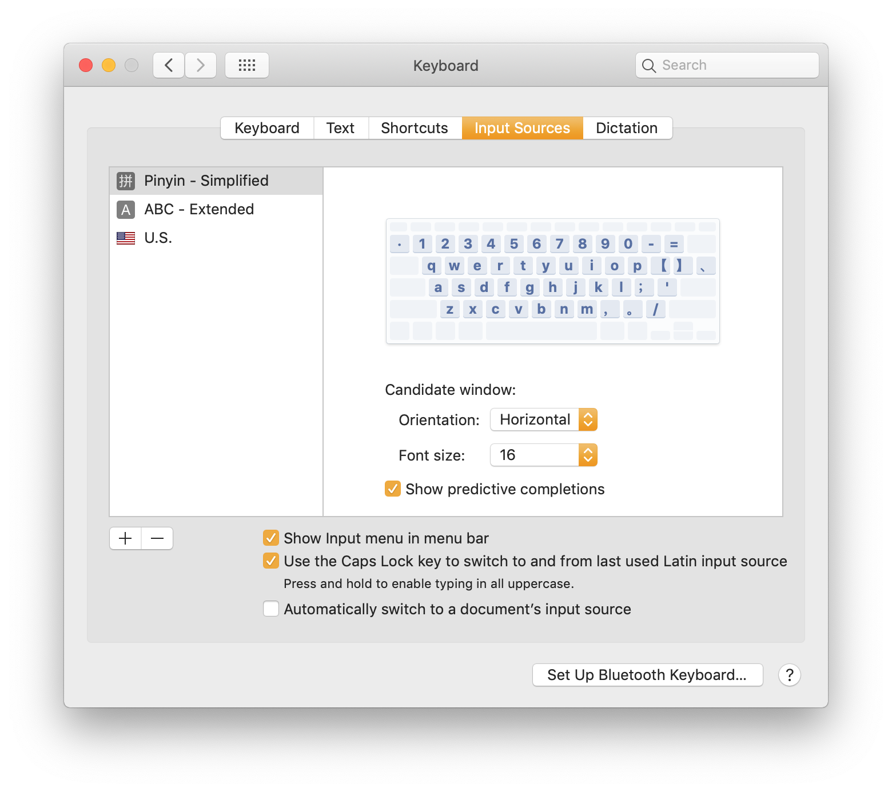

# Chinese

Chinese is a pictographic language—it's built on pictures. Chinese characters are drawn left to right and top to bottom, and are built upon other characters in the language, like dominos.

Pinyin is the pronunciation of each character in Chinese. Pinyin includes different tones and short sylables.

## Resources

* [Domino Chinese](https://www.dominochinese.com) - extraordinary online course that's helpful to get started learning Chinese.
* [Duolingo](https://github.com/kunalgorithm/wiki/tree/7d22d2f3d4e50b356190050fcf1f434a51eeab09/chinese/duolingo.com) - useful for gamified vocabulary acquisition on the go.
* [Type Chinese on your Mac](http://pinpinchinese.com/blog/how-to-use-pinyin-to-type-chinese-mac/)
* [Type Pinyin characters on your Mac](http://pinpinchinese.com/blog/how-to-type-pinyin-tone-marks-mac-os-x-yosemite/)
* [Pinyin Pronunciation Chart](http://www.learnhanzi.com/pronunciation/pinyinchart.php)

It's also useful to use `Caps Lock` on Mac to change Keyboard languages 

