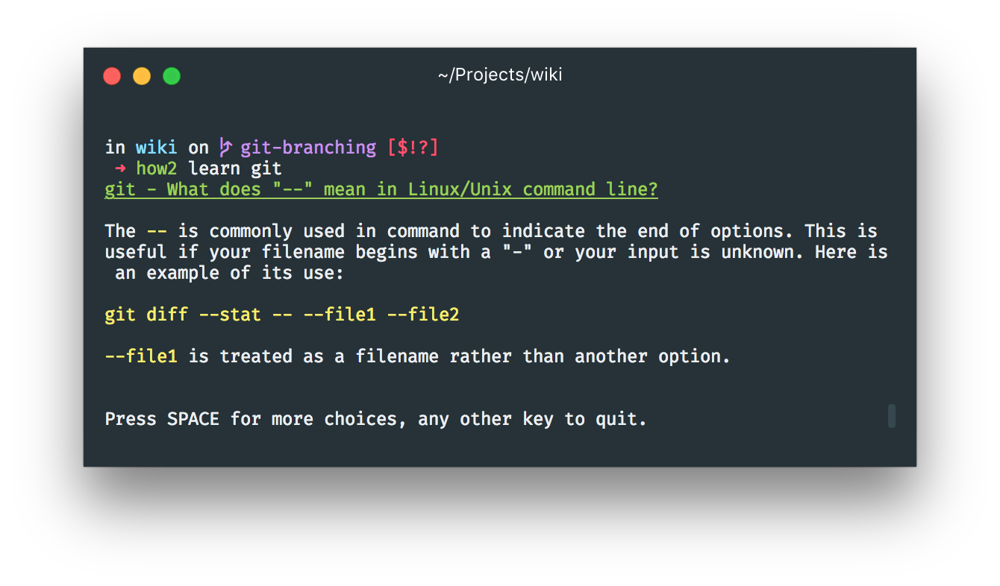

# Command Line Tools

[Awesome CLI Apps](https://github.com/agarrharr/awesome-cli-apps)

## Tools installed globalled

[`now`](https://now.sh) - Instant serverless deployments with ZEIT now. It's my go-to for all static site and nodeJS application deployments. [`tldr`](https://github.com/tldr-pages/tldr) - Simplified and community-driven `man` pages

[`how2`](https://github.com/santinic/how2) - Search Stackoverflow from the Terminal

[`ghwd`](https://github.com/github-modules/ghwd) - Open the github URL that matches your shell's current branch and working directory

[`mdx docs`](https://github.com/jxnblk/ok-mdx) - Browser-based [MDX](https://github.com/mdx-js/mdx) editor

[`fuck`](https://github.com/nvbn/thefuck) - Magnificent app which corrects your previous console command.

